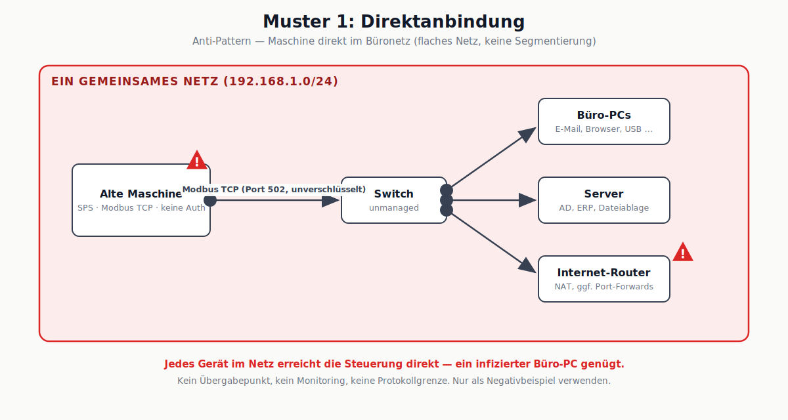
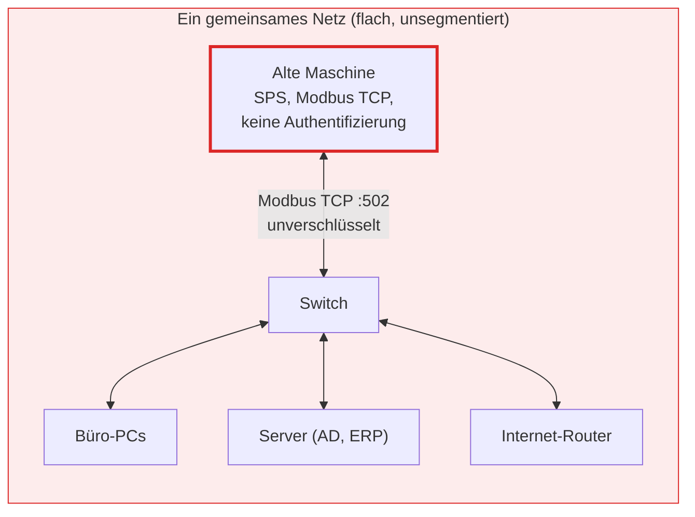

# Muster 1: Direktanbindung (Anti-Pattern)

## Beschreibung

Die Maschine wird ohne jede Zwischenschicht in das bestehende Büronetz gesteckt. Es gibt genau ein flaches Netz: Steuerung, Büro-PCs, Server und Internet-Router hängen am selben Switch. Jedes Gerät kann jedes andere direkt erreichen – auch die SPS, deren Protokoll (z. B. Modbus TCP) keinerlei Authentifizierung kennt.

**Dieses Muster ist kein Zielbild, sondern der Ist-Zustand in vielen kleinen Betrieben.** Es steht hier bewusst am Anfang: Alle anderen Muster sind Antworten auf genau diese Ausgangslage.

## Stärken

- Null Anschaffungskosten, null zusätzliche Komponenten
- In Minuten "umgesetzt" – Kabel rein, fertig
- Keine neue Kompetenz nötig

## Schwächen

- **Jedes** Gerät im Netz erreicht die ungeschützte Steuerung – ein infizierter Büro-PC oder ein Phishing-Klick genügt für Zugriff auf die Maschine
- Kein Übergabepunkt: kein Monitoring, kein Logging, keine Protokollgrenze
- Broadcast-/Scan-Traffic aus der IT kann alte Steuerungen zum Absturz bringen (reale Gefahr bei Geräten aus den 2000ern)
- Garantie-/Zertifizierungsverlust je nach Herstellervertrag
- Kein Rollback: Ist die SPS kompromittiert, gibt es oft kein Patch und keinen Ersatz

## Passende Einsatzgebiete

- **Produktiv: keine.**
- Vertretbar ausschließlich in einem physisch isolierten Laboraufbau ohne Verbindung zu anderen Netzen (Air Gap) – und selbst dort nur mit dokumentiertem Restrisiko.

## Diskussionsfragen für den Kurs

1. Der Betrieb hat 12 Mitarbeiter und "keine IT-Abteilung". Ist das Muster damit entschuldbar? Welche minimale Verbesserung kostet unter 100 €?
2. Welche der Schwächen bleibt bestehen, selbst wenn alle Büro-PCs perfekt gepatcht sind?
3. Ordnet die Schwächen den Kategorien aus Modul 2 zu: Sicherheit / Stabilität / Betrieb / Wartbarkeit.

## Bereinigtes Mermaid-Diagramm

