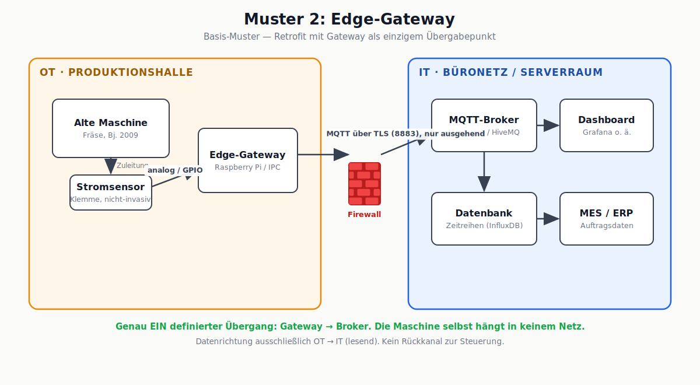
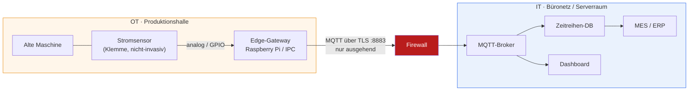

# Muster 2: Edge-Gateway (Basis-Muster)

## Beschreibung

Das Retrofit-Muster aus der Vorlesung: Ein nicht-invasiver Stromsensor an der Zuleitung liefert Messwerte an ein Edge-Gateway (Raspberry Pi oder Industrie-PC). Das Gateway glättet, erkennt Lauf/Stillstand und publiziert per MQTT über TLS an einen Broker im IT-Netz. Eine Firewall trennt OT und IT; die einzige erlaubte Verbindung ist die **ausgehende** des Gateways zum Broker (Port 8883). Die Maschine selbst hängt in keinem Netz – sie wird nur "belauscht".

## Stärken

- Kein Eingriff in die Maschine → keine Garantie-/Zertifizierungsprobleme, keine Herstellerabstimmung
- Genau ein definierter, überwachbarer Übergabepunkt
- Entkopplung: IT-Änderungen berühren die Maschine nicht und umgekehrt
- Günstig (Sensor + Pi: unter 200 € pro Maschine) und in Tagen umsetzbar
- Datenrichtung ausschließlich OT → IT – kein Rückkanal, minimale Angriffsfläche

## Schwächen

- Nur abgeleitete Daten (Lauf/Stillstand, Energieverbrauch) – keine Prozessdaten aus der Steuerung (Drehzahl, Stückzahl, Fehlercodes)
- Broker steht im IT-Netz: Kompromittierte IT sieht alle Maschinendaten und kann den Broker manipulieren
- Gateway ist Single Point of Failure der Messkette (die Produktion läuft weiter, aber es entsteht ein Daten-Blindflug)
- Skaliert organisatorisch schlecht: Bei 40 Maschinen braucht es Gateway-Management (Updates, Monitoring, Inventar)
- Raspberry Pi im Dauerbetrieb: SD-Karten-Verschleiß, keine redundante Versorgung

## Passende Einsatzgebiete

- Erste Digitalisierungsschritte in KMU: Auslastungs- und Stillstandsanalyse ohne Umbau
- Proof of Concept vor größeren Investitionen
- Einzelne Altmaschinen, bei denen ein Steuerungszugriff unmöglich oder unwirtschaftlich ist
- Umgebungen, in denen IT und OT organisatorisch dieselbe kleine Mannschaft sind (die strikte Zonentrennung aus Muster 3 wäre hier Overhead ohne Betreiber)

## Diskussionsfragen für den Kurs

1. Der Geschäftsführer will "auch die Stückzahlen sehen". Was ändert sich an diesem Muster – und an seinem Risikoprofil?
2. Warum ist "nur ausgehend" bei der Firewall-Regel so wichtig? Was wäre der Unterschied zu einer eingehenden Freigabe auf das Gateway?
3. Das Gateway fällt Freitagabend aus, es merkt niemand bis Montag. Welche Maßnahme aus der Vorlesung fehlt in diesem Bild?

## Bereinigtes Mermaid-Diagramm

