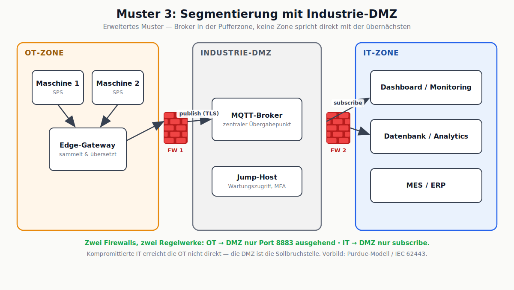
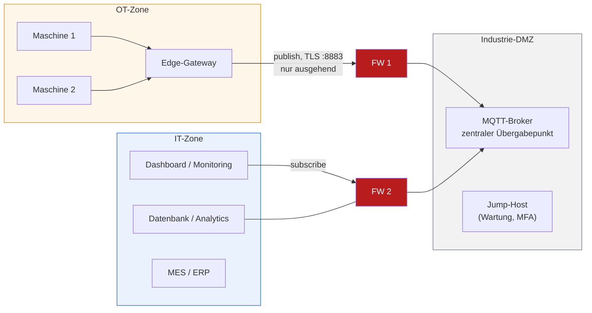

# Muster 3: Segmentierung mit Industrie-DMZ

## Beschreibung

Die Weiterentwicklung von Muster 2 für Umgebungen mit echten Schutzanforderungen: Zwischen OT-Zone und IT-Zone liegt eine eigene Pufferzone, die **Industrie-DMZ**. Der MQTT-Broker steht dort – nicht in der IT. Zwei Firewalls mit getrennten Regelwerken sorgen dafür, dass keine Zone direkt mit der übernächsten spricht: Das Gateway darf nur **ausgehend** in die DMZ publizieren (TLS 8883), IT-Systeme dürfen nur aus der DMZ **subscriben**. Wartungszugriffe auf die OT laufen ausschließlich über einen Jump-Host in der DMZ (mit MFA und Protokollierung). Konzeptionelles Vorbild sind das Purdue-Modell und die Zonen/Conduits aus IEC 62443.

## Stärken

- Kompromittierte IT erreicht die OT nicht direkt – die DMZ ist die kontrollierte Sollbruchstelle
- Kompromittierte OT erreicht die IT nicht direkt (gilt in beide Richtungen)
- Broker als zentraler, überwachbarer Übergabepunkt mit klarem Eigentümer
- Wartungszugriffe sind erzwungen protokolliert (Jump-Host) – auditierbar, NIS2-tauglich
- Skaliert auf viele Maschinen und mehrere Gateways ohne neue Übergänge

## Schwächen

- Deutlich höherer Aufbau- und Betriebsaufwand: zwei Firewall-Regelwerke, eigene DMZ-Systeme, klare Zuständigkeit nötig ("Wer betreibt die DMZ?" ist ein politisches Thema)
- Broker und Jump-Host müssen selbst gehärtet, gepatcht und überwacht werden – die DMZ ist nur so gut wie ihr Betrieb
- Latenz und Komplexität steigen; Fehlersuche geht über drei Zonen
- Für einzelne Maschinen wirtschaftlich kaum zu rechtfertigen

## Passende Einsatzgebiete

- Produktionsbetriebe ab mittlerer Größe mit eigener IT- **und** OT-Verantwortung
- Umgebungen mit regulatorischen Anforderungen (NIS2, KRITIS, Kunden-Audits)
- Standorte, an denen bereits ein Sicherheitsvorfall oder ein Audit-Finding existiert
- Überall dort, wo neben Monitoring perspektivisch auch schreibende Zugriffe (Parameter, Aufträge) geplant sind – ohne DMZ ist ein Rückkanal nicht verantwortbar

## Diskussionsfragen für den Kurs

1. Warum steht der Broker in der DMZ und nicht in der IT (Muster 2)? Was genau gewinnt man durch den Umzug?
2. FW 1 erlaubt nur "OT → DMZ, Port 8883, ausgehend". Ein Techniker braucht Fernzugriff auf das Gateway. Wie löst dieses Muster das, ohne die Regel aufzuweichen?
3. Welche der Komponenten in diesem Bild ist am attraktivsten für einen Angreifer – und warum?

## Bereinigtes Mermaid-Diagramm

