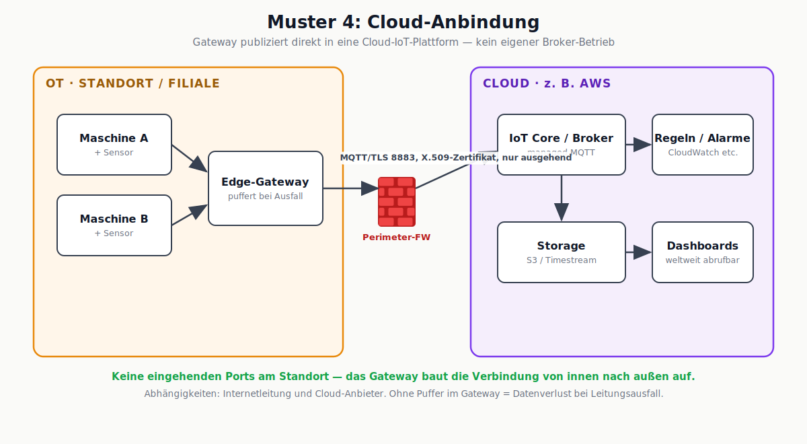
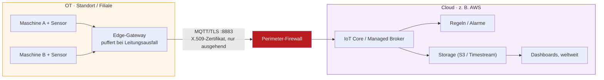

# Muster 4: Cloud-Anbindung

## Beschreibung

Statt eines eigenen Brokers publiziert das Edge-Gateway direkt in eine **Cloud-IoT-Plattform** (z. B. AWS IoT Core). Die Verbindung ist ausschließlich ausgehend, per TLS auf Port 8883 und mit X.509-Geräte-Zertifikaten authentifiziert – am Standort wird **kein einziger eingehender Port** geöffnet. Speicherung, Regeln, Alarme und Dashboards liegen als Managed Services in der Cloud. Das Gateway puffert Daten lokal (Store-and-Forward), damit ein Leitungsausfall keine Datenverluste erzeugt.

## Stärken

- Kein eigener Broker-Betrieb: Verfügbarkeit, Patching und Skalierung übernimmt der Anbieter
- Standortunabhängig: mehrere Werke/Filialen publizieren in dieselbe Plattform, Dashboards sind weltweit abrufbar
- Starke Geräte-Authentifizierung (Zertifikate pro Gerät) ist bei den großen Plattformen Standard, nicht Zusatzaufwand
- Keine eingehenden Firewall-Freigaben am Standort nötig
- Pay-per-use: kein Vorab-Invest in Server-Infrastruktur

## Schwächen

- **Abhängigkeit von Internetleitung und Cloud-Anbieter** – ohne lokalen Puffer im Gateway bedeutet ein Leitungsausfall Datenverlust, und lokale Dashboards in der Halle funktionieren ohne Zusatzkomponenten nicht
- Laufende Kosten skalieren mit Nachrichtenvolumen – wer Rohdaten statt Ereignisse publiziert, bezahlt es monatlich (Bogen zur Datenreduktions-Folie)
- Datenschutz/Compliance: Maschinendaten liegen bei einem Dritten; je nach Branche und Kundenverträgen prüfungspflichtig
- Vendor Lock-in bei plattformspezifischen Diensten (Rules Engine, Device Shadow etc.)
- Latenz: für Auswertungen egal, für zeitkritische lokale Reaktionen ungeeignet

## Passende Einsatzgebiete

- Verteilte Standorte ohne lokales IT-Personal (Filialen, Außenanlagen, Windräder, Pumpstationen)
- Betriebe, die bereits Cloud-Strategie und -Kompetenz haben (unser Kurskontext: AWS)
- Anwendungen, deren Auswertung ohnehin zentral erfolgt (Flottenvergleich, Benchmarks über Werke hinweg)
- **Nicht geeignet**, wenn Reaktionen lokal und in Echtzeit erfolgen müssen oder wenn vertragliche/regulatorische Vorgaben Datenhaltung im Haus verlangen

## Diskussionsfragen für den Kurs

1. Die Internetleitung des Standorts fällt für 4 Stunden aus. Was passiert (a) mit der Produktion, (b) mit den Daten, (c) mit den Dashboards? Welche Komponente in diesem Bild entscheidet über (b)?
2. Vergleicht die monatlichen Kosten gedanklich: 100 Messwerte/s roh in die Cloud vs. Statusereignisse. Welches Prinzip aus Modul 2 spart hier bares Geld?
3. Wann ist Muster 3 (eigene DMZ) trotz höherem Aufwand die bessere Wahl als dieses Muster?

## Bereinigtes Mermaid-Diagramm

